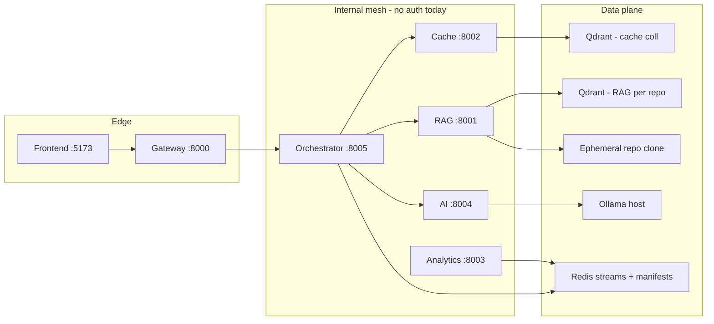
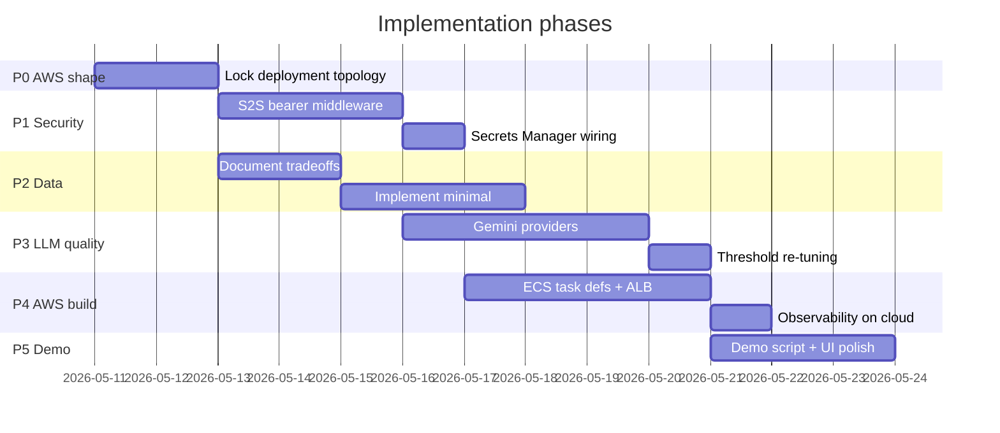

# SemCacheLM — Enterprise Readiness Roadmap

> **Note:** The codebase uses **Google Gemini only** for embeddings and generation; local Ollama paths described in older revisions have been removed. Some sections below retain dual-provider wording as historical planning context.

**Course:** CMPE 273 — Enterprise Distributed Systems, SJSU  
**Scope:** Five-phase plan covering AWS deployment shape, service-to-service security, data replication and consistency, LLM quality/latency improvements, and demo polish. Each phase must be completed (or consciously deferred with a written rationale) before the final presentation.

---

## 1. Executive Summary

SemCacheLM is a production-grade semantic caching system built on six FastAPI microservices, backed by two separate Qdrant namespaces (semantic-cache and per-repo RAG chunks), Redis Streams, and a GitHub-sourced repo clone for RAG indexing. The system works but has four gaps that need closing before the final demo:

| Gap | Current state | Target state |
|-----|--------------|--------------|
| AWS deployment | Single-container stub (`docker-compose.aws.yml`) mismatches the real six-service mesh | ECS Fargate multi-task deployment matching local compose |
| Service-to-service auth | All `/internal/v1/...` routes are unauthenticated over the wire | Shared bearer-token middleware; secrets via AWS Secrets Manager |
| Data replication + consistency | Single-node Qdrant, Redis with no replication group, ephemeral repo clone | Documented + partially implemented: Qdrant Cloud or EBS snapshot, ElastiCache replication, EFS or S3 for clone |
| LLM quality + latency | Gemini defaults; validator prompt may still mis-judge edge cases | Tune prompts/thresholds; optional faster Gemini sku or regional latency tuning |

**Non-goals for CMPE scope:** multi-region active-active, knowledge graph integration, zero-downtime blue/green deploys.

---

## 2. Architecture Snapshot

### Current local mesh

```
React (Vite + Tailwind)
        │ HTTP
        ▼
    Gateway :8000  ──────────────────────────────────────────────────────┐
        │                                                                 │
        │ HTTP /internal                                                  │
        ▼                                                                 ▼
  Orchestrator :8005                                               Analytics :8003
    │       │       │                                                     │
    │       │       │                                              Redis Streams
    ▼       ▼       ▼
  Cache   RAG    AI Svc
  :8002  :8001   :8004
    │       │       │
    │       │       └── Ollama :11434 (host)
    │       │
    │       ├── Qdrant RAG  (collection: semcachelm_rag_chunks__{repo})
    │       └── Ephemeral clone  (rag_repo_cache_dir)
    │
    └── Qdrant Cache (collection: semcachelm_cache)
```



### Key port and config facts

- Semantic cache uses `settings.qdrant_collection` = `semcachelm_cache` (768-dim cosine, matches `nomic-embed-text`).
- RAG uses `settings.rag_qdrant_collection` prefix: one Qdrant collection per repo key — `semcachelm_rag_chunks__{repo}`.
- Redis manifest key pattern: `semcache:rag:index:v1:{collection_name}` — used by `rag_qdrant_indexing.py` to fingerprint files and skip re-index when unchanged.
- Default thresholds: hit ≥ 0.92, gray zone 0.70–0.92, fallback < 0.70.
- Validator (`false_hit_detector.py`) uses the **same `LLMClient` port** as generation — swapping the model there affects judgment quality directly.

---

## 3. Phase Schedule



**Why this order:** AWS shape must be locked first so security and data decisions target the right topology. Security is cheapest to add before services reach public subnets. Data/replication choices depend on managed vs self-hosted decisions made in P0. Gemini/provider work is easiest to A/B once auth is in place and the environment is stable. Demo is polished last so timing and badges reflect real behavior.

---

## 4. Phase 0 — Lock the AWS Deployment Shape

### Problem: `docker-compose.aws.yml` is a one-service stub

The current [`docker-compose.aws.yml`](../docker-compose.aws.yml) builds and exposes **only the gateway** (`services/gateway/Dockerfile`). It does not include rag, cache, analytics, ai, orchestrator, Redis, Qdrant, or the frontend. It is a placeholder, not a real deploy.

The real local stack ([`docker-compose.yml`](../docker-compose.yml)) runs:

| Service | Port | Notes |
|---------|------|-------|
| gateway | 8000 | Public entry point |
| rag | 8001 | Clones + indexes repos; needs disk |
| cache | 8002 | Qdrant reads/writes |
| analytics | 8003 | Redis stream consumer |
| ai | 8004 | Ollama proxy |
| orchestrator | 8005 | Query routing + streaming |
| redis | 6379 | Streams, manifests, sessions |
| qdrant | 6333 | Two logical namespaces |
| frontend | 5173 | Nginx-served static |
| prometheus | 9090 | Metrics scrape |
| grafana | 3000 | Dashboards |

### Recommended AWS target topology (ECS Fargate)

For a course demo, **do not collapse everything into one process** — that erases the microservice architecture story. Use this ECS task grouping:

| ECS Task | Services inside | CPU / Memory estimate | Notes |
|----------|-----------------|-----------------------|-------|
| `gateway-task` | gateway | 0.5 vCPU / 1 GB | Public-facing; behind ALB |
| `orchestrator-task` | orchestrator | 0.5 vCPU / 1 GB | Internal only |
| `ai-task` | ai | 0.5 vCPU / 1 GB | Calls Gemini API (no Ollama on ECS) |
| `cache-task` | cache | 0.5 vCPU / 1 GB | Qdrant client |
| `rag-task` | rag | 1 vCPU / 2 GB | Needs clone + index headroom |
| `analytics-task` | analytics | 0.5 vCPU / 512 MB | Redis stream consumer |
| `frontend-task` | frontend (nginx) | 0.25 vCPU / 512 MB | Or S3 + CloudFront |

Data services (Qdrant, Redis) run as **separate ECS services** with EBS volumes, or are replaced by Qdrant Cloud + ElastiCache (recommended for a class demo — no volume management).

### Ollama on AWS

Ollama does not run on Fargate (no GPU, container size). The options are:

1. **EC2 GPU instance** — run Ollama, set `OLLAMA_BASE_URL` to that instance's private IP. Costs money, requires managing.
2. **Gemini via `AI_PROVIDER=gemini`** — set the env var to switch the AI service to Gemini at runtime. **Recommended for AWS demo** — same image as local; details in Phase 3.
3. **Demo with Ollama on a laptop** and point the AWS gateway at a tunnel. Fragile; avoid for final demo.

**Recommended flow:** develop locally with `AI_PROVIDER=ollama`; test the Gemini path locally by setting `AI_PROVIDER=gemini` + `GEMINI_API_KEY` in `.env` (no AWS needed); deploy to ECS with `AI_PROVIDER=gemini` and `GEMINI_API_KEY` from Secrets Manager. Zero code changes between environments.

**Action items:**
- Replace or extend `docker-compose.aws.yml` to cover all six app services + data services (or document managed replacements).
- Add per-service `Dockerfile` correctness check (currently only gateway Dockerfile is tested in AWS compose).
- Document all env vars needed per task; start from `backend/.env.example`.
- Remove `host.docker.internal` references — replace with ECS service-discovery DNS names (e.g. `ai.semcachelm.local`) via AWS Cloud Map.

---

## 5. Phase 1 — Secure Service-to-Service Interactions

### Current gap

All six internal services expose `/internal/v1/...` routes with **no authentication**. The shared HTTP clients (`backend/shared/clients/http/*.py`) forward a `x-correlation-id` header but no secret. Any process inside the VPC (or any mis-routed request) can call these endpoints.

Example: `HttpAIClient._post()` in `shared/clients/http/ai.py` constructs headers with only the correlation ID. The same pattern exists in the analytics, RAG, cache, and orchestrator clients.

### Minimal viable implementation — shared bearer token

1. **Add `INTERNAL_SERVICE_TOKEN` env var** to `backend/shared/config/settings.py`:
   ```python
   internal_service_token: str = Field(default="", description="Shared bearer token for S2S internal routes.")
   ```

2. **Add FastAPI middleware** (`backend/shared/infra/internal_auth.py`) that validates `Authorization: Bearer <token>` on requests to paths matching `/internal/`. Return `403` if the token is absent or wrong. Skip check if `internal_service_token` is empty (local dev).

3. **Propagate the token** in each shared HTTP client's `_post` / `_request` method — read `settings.internal_service_token` and inject as `Authorization: Bearer ...` header alongside `x-correlation-id`.

4. **Mount the middleware** on each service's `main.py` that includes an internal router (`cache`, `rag`, `ai`, `analytics`, `orchestrator`).

5. **Store in AWS Secrets Manager** — key: `semcachelm/internal-service-token`. Inject as `INTERNAL_SERVICE_TOKEN` environment variable at ECS task start via `secrets:` block in task definition.

### Stronger option (document, implement optionally)

- **App Mesh with mTLS** between ECS tasks — eliminates the shared-secret problem but requires service mesh infra. Too heavyweight for a course demo; worth one paragraph in the architecture doc.
- **Per-service tokens** instead of a single shared token — better blast-radius isolation. Still feasible with five Secrets Manager keys.

### Public gateway auth

For grader/demo multi-user access, add an optional `x-api-key` header check on public `/api/v1/*` routes in the gateway (separate from the internal S2S token). Store in Secrets Manager. Skip for single-user demo.

---

## 6. Phase 2 — Replication and Consistency Tradeoffs

### Per-store analysis

#### Qdrant — semantic cache collection (`semcachelm_cache`)

| Aspect | Detail |
|--------|--------|
| Role | Stores `(query_text, embedding, response, metadata)` for reuse |
| Write path | `cache_writer.store()` in orchestrator; also `increment_hit()` on cache hit |
| Read path | `cache_reader.search(embedding, top_k)` — ANN lookup |
| Consistency model | Single-node: strong read-after-write within node. No replicas today. |
| Failure mode | Node down → all cache misses; system falls back to RAG/LLM (degraded, not broken) |
| Replication option | **Qdrant Cloud** distributed cluster (replication factor 2) or Qdrant OSS with `replication_factor=2` in collection config. For CMPE demo: Qdrant Cloud free tier is sufficient. |
| Demo reset | `DELETE /api/v1/cache/{id}` or `docker compose down -v` locally; on AWS: Qdrant collection drop + recreate via admin script. |

#### Qdrant — RAG chunk collections (`semcachelm_rag_chunks__{repo}`)

| Aspect | Detail |
|--------|--------|
| Role | Stores chunked code/doc vectors for retrieval-augmented generation |
| Source of truth | Git repository — always rebuildable from `RAG_REPO_PATH` |
| Fingerprint | `rag_qdrant_indexing.repo_files_fingerprint()` hashes file paths, sizes, mtimes, and embedding/chunk params; stored in Redis under `semcache:rag:index:v1:{collection}`. Re-index only triggered when fingerprint changes. |
| Failure mode | If Qdrant is lost, RAG service re-indexes on next startup (expensive but recoverable). |
| Replication option | Same as cache collection. If rebuilding from Git is acceptable, replication is optional — just ensure the Redis manifest is not stale on restart. |

#### Redis

| Aspect | Detail |
|--------|--------|
| Roles | Redis Streams (async query pipeline, analytics events), validator verdict TTL cache, session context, RAG index manifests |
| Stream delivery | Consumer groups + XACK = **at-least-once**. Stream workers (`orchestrator/app/stream_worker.py`) must be idempotent for repeated event processing. |
| Replication option | **ElastiCache for Redis** with one replica node. Use `cluster_mode=disabled`, one primary + one replica for the demo. Failover ~30 s — acceptable for a class demo. |
| Data loss risk | If Redis is wiped: streams lose pending events (queries in flight), validator cache is cold (extra LLM calls), session context lost (minor), RAG manifests lost → re-index on next request. No permanent data loss; cache vectors live in Qdrant. |

#### Local repo clone (`rag_repo_cache_dir`)

| Aspect | Detail |
|--------|--------|
| Role | Working directory for LlamaIndex to read files and build chunk vectors |
| Lifecycle | Cloned once at RAG service startup; ephemeral working directory only (vectors persist in Qdrant) |
| ECS challenge | Fargate ephemeral storage ≤ 20 GB default (expandable to 200 GB). RAG_REPO_PATH pointing to a GitHub org with `RAG_ORG_REPO_LIMIT=25` repos could require significant disk. |
| Options | (1) **EFS mount** on the RAG task — durable, multi-AZ, but adds latency and cost. (2) **Ephemeral Fargate storage** — clone on each task start; acceptable if RAG service rarely restarts. (3) **Pre-index at build time** — index is baked into the Qdrant collection before deploy; RAG task skips clone entirely (fastest). Option 3 is recommended for the demo. |

### CAP summary

SemCacheLM makes a deliberate **availability over consistency** choice: if the cache Qdrant node is unreachable, queries still get answered by RAG/LLM (the `cache.search_degraded` warning path in `stream_worker.py`). The cache is a performance optimization, not a required dependency. Document this explicitly in the architecture section.

### Implementation checklist

- [ ] Qdrant Cloud account + cluster; update `QDRANT_HOST` / `QDRANT_PORT` in task env.
- [ ] ElastiCache replication group; update `REDIS_HOST` in task env.
- [ ] Set `replication_factor: 2` in `ensure_collection()` call if using self-hosted Qdrant.
- [ ] Verify `stream_worker.py` XACK path is idempotent for repeated delivery.
- [ ] Document "wipe + restore" procedure for demo reset on AWS.
- [ ] Set Fargate ephemeral storage to 30 GB for RAG task; or pre-index and disable clone on startup.

---

## 7. Phase 3 — Performance and Judgment Quality

### Design principle: one codebase, three runtime modes

The AI service must work identically in three configurations without rebuilding images or changing code:

| Mode | `AI_PROVIDER` | `OLLAMA_BASE_URL` | `GEMINI_API_KEY` | When to use |
|------|--------------|-------------------|------------------|-------------|
| **Local / Ollama** | `ollama` | `http://localhost:11434` | _(not needed)_ | Normal local dev; fastest iteration |
| **Local / Gemini** | `gemini` | _(ignored)_ | set to your key | Testing the cloud code path before deploying to AWS |
| **AWS / Gemini** | `gemini` | _(ignored)_ | from Secrets Manager | Production demo on ECS |

The **same Docker image** is used in all three modes. The only difference is which env vars are set. This means you can fully validate the Gemini path on your laptop before touching AWS — point `.env` at Gemini locally, run `docker compose up` or start services manually, and the behavior will be identical to what runs on ECS.

#### Local `.env` for Ollama mode (current default)

```env
AI_PROVIDER=ollama
OLLAMA_BASE_URL=http://localhost:11434
OLLAMA_LLM_MODEL=llama3.1:8b
OLLAMA_EMBEDDING_MODEL=nomic-embed-text
GEMINI_API_KEY=          # leave empty
```

#### Local `.env` for Gemini mode (test cloud path locally)

```env
AI_PROVIDER=gemini
GEMINI_API_KEY=AIzaSy...      # your key
GEMINI_LLM_MODEL=gemini-2.0-flash
GEMINI_EMBEDDING_MODEL=text-embedding-004
OLLAMA_BASE_URL=http://localhost:11434   # kept for fallback reference; not called
```

Docker Compose does not need to change — the AI service container just reads the env var and picks the right provider. For local Gemini testing you do **not** need Ollama running at all.

---

### Baseline first

Before changing anything, use the existing Grafana dashboards (`http://localhost:3000`) to record p50/p99 for:
- `semcachelm_llm_latency_seconds` (embed, infer, judge labels)
- End-to-end query latency from gateway logs
- Cache hit rate (`semcachelm_cache_hits_total` / total queries)

This gives a before/after story for the demo and is easy to repeat in each of the three modes above.

### LLM provider matrix

The AI service already has clean ports (`EmbeddingService`, `LLMClient` ABCs in `shared/domain/model_providers.py`). The `FalseHitDetector` in `orchestrator/app/domain/false_hit_detector.py` uses the same `LLMClient` port for its judge calls. **Provider swaps require no structural changes** — only new concrete implementations wired via the `AI_PROVIDER` flag.

| Use | Ollama mode | Gemini mode | Notes |
|-----|-------------|-------------|-------|
| Embeddings | `nomic-embed-text` via `OllamaEmbeddingService` | `text-embedding-004` via `GeminiEmbeddingService` | Both output 768-dim vectors — no Qdrant re-index needed |
| LLM generation | `llama3.1:8b` via `OllamaLLMClient` | `gemini-2.0-flash` via `GeminiLLMClient` | Flash is much faster and higher quality than local 8B |
| Validator / judge | Same `llama3.1:8b` via `LLMClient` | `gemini-2.0-flash` via `GeminiLLMClient` | Judge prompt (`VERDICT / CONFIDENCE / REASON` format in `false_hit_detector.py`) is well-structured — Flash parses it reliably |

#### Embedding dimension compatibility

`text-embedding-004` from Google defaults to **768 dimensions** — the same as `nomic-embed-text`. This is the critical design constraint that makes the swap safe. The Qdrant collection does **not** need to be dropped or recreated. If you ever consider a different embedding model that outputs a different dimension (e.g. 1536), the collections must be dropped and all entries re-indexed — avoid this for the demo window.

Always verify on AI service startup that `len(embedding)` from `AIInferenceService.embed()` matches `settings.qdrant_vector_size` (default 768) before writing to Qdrant.

#### Implementation steps for Gemini providers

1. Add `google-genai` to `backend/requirements.txt` (official Google GenAI SDK).
2. Add settings fields to `backend/shared/config/settings.py`:
   ```python
   ai_provider: str = Field(default="ollama", description="AI provider: 'ollama' or 'gemini'.")
   gemini_api_key: str = Field(default="", description="Google Gemini API key.")
   gemini_llm_model: str = Field(default="gemini-2.0-flash", description="Gemini model for generation and judging.")
   gemini_embedding_model: str = Field(default="text-embedding-004", description="Gemini model for embeddings.")
   ```
3. Create `backend/services/ai/app/services/gemini_embedding.py` implementing `EmbeddingService` using `google.genai`.
4. Create `backend/services/ai/app/services/gemini_llm.py` implementing `LLMClient` using `google.genai`.
5. In `backend/services/ai/app/main.py`, wire the correct implementation:
   ```python
   if settings.ai_provider == "gemini":
       embedder = GeminiEmbeddingService(settings)
       llm = GeminiLLMClient(settings)
   else:
       embedder = OllamaEmbeddingService(settings, http_client)
       llm = OllamaLLMClient(settings, http_client)
   ```
6. Add both Gemini and Ollama vars to `backend/.env.example` (with Ollama as the default). Users flip `AI_PROVIDER` to switch.
7. Update `docker-compose.yml` to pass `AI_PROVIDER` and `GEMINI_API_KEY` through to the `ai` service container so local Gemini testing via Docker Compose also works.
8. On AWS: store `GEMINI_API_KEY` in Secrets Manager (`semcachelm/gemini-api-key`); inject via ECS task `secrets:` block.

### Threshold and judgment tuning

The current thresholds (`hit ≥ 0.92`, `gray zone 0.70–0.92`) were calibrated for Ollama embeddings. Since `text-embedding-004` produces the same 768-dim space, the distribution should be similar — but re-calibrate after switching by:

1. Running the demo sequence with Gemini mode enabled locally.
2. Checking `semcachelm_similarity_score` histogram in Grafana.
3. Adjusting `SIMILARITY_HIT_THRESHOLD` and `SIMILARITY_GRAY_ZONE_LOW` until hit/validate/fallback badges appear at intuitively correct points.
4. The validator prompt in `false_hit_detector.py` does not need changes — the improvement comes entirely from model quality.

### RAG startup latency

The RAG service clones and indexes repos on first startup, blocking queries until done. To avoid a slow first query in the demo:
- Add a `/readiness` probe to the RAG service that returns `503` until indexing completes (separate from the existing `/metrics` health check).
- In ECS task definition, set `healthCheckGracePeriodSeconds` high enough for the first index build.
- Long-term: pre-index at build time (see Phase 2 data section).

RAG indexing uses LlamaIndex with the `OllamaEmbedding` model hardcoded in `rag_service.py`. When switching to Gemini for the AI service, also update the RAG service's LlamaIndex embedding model — pass `AI_PROVIDER` and Gemini settings to the RAG service so chunk embeddings use the same model as query embeddings. Mismatching embedding models between indexing and query time will produce incorrect similarity scores.

---

## 8. Phase 4 — AWS Build-Out

### Networking

```
Internet
    │
    ▼
  ALB (public subnet, port 80/443)
    │
    ├── /api/*  → gateway ECS service (private subnet)
    └── /       → frontend ECS service (or CloudFront + S3)

  All internal services (orchestrator, cache, rag, ai, analytics)
    └── Private subnet only; no inbound from internet
    └── Service discovery via AWS Cloud Map: e.g. ai.semcachelm.local

  Data plane (private subnet):
    └── Qdrant Cloud (external, TLS) or Qdrant ECS service + EBS
    └── ElastiCache Redis (private subnet endpoint)
```

### Provider env vars across environments

Set these in each environment's `.env` file (local) or ECS task definition (AWS). The same image is used everywhere — only these values change:

| Env var | Local / Ollama | Local / Gemini test | AWS / Gemini |
|---------|---------------|---------------------|--------------|
| `AI_PROVIDER` | `ollama` | `gemini` | `gemini` |
| `OLLAMA_BASE_URL` | `http://localhost:11434` | _(set but not called)_ | _(not needed)_ |
| `GEMINI_API_KEY` | _(empty)_ | your key in `.env` | from Secrets Manager |
| `GEMINI_LLM_MODEL` | _(empty)_ | `gemini-2.0-flash` | `gemini-2.0-flash` |
| `GEMINI_EMBEDDING_MODEL` | _(empty)_ | `text-embedding-004` | `text-embedding-004` |

For Docker Compose local Gemini testing, add to the `ai` service in `docker-compose.yml`:
```yaml
environment:
  AI_PROVIDER: ${AI_PROVIDER:-ollama}
  GEMINI_API_KEY: ${GEMINI_API_KEY:-}
  GEMINI_LLM_MODEL: ${GEMINI_LLM_MODEL:-gemini-2.0-flash}
  GEMINI_EMBEDDING_MODEL: ${GEMINI_EMBEDDING_MODEL:-text-embedding-004}
```
Then set `AI_PROVIDER=gemini` and `GEMINI_API_KEY=...` in your local `.env` at the repo root to test the Gemini path without AWS.

### Secrets

| Secret | Secrets Manager key | Service |
|--------|--------------------|---------| 
| `INTERNAL_SERVICE_TOKEN` | `semcachelm/internal-service-token` | All six services |
| `GEMINI_API_KEY` | `semcachelm/gemini-api-key` | ai task, rag task |
| `RAG_GITHUB_TOKEN` | `semcachelm/rag-github-token` | rag task |
| `QDRANT_API_KEY` | `semcachelm/qdrant-api-key` | cache, rag tasks (if Qdrant Cloud) |

**Never bake secrets into Docker images.** Use `secrets:` blocks in ECS task definitions to inject at runtime. The `GEMINI_API_KEY` secret is only resolved when `AI_PROVIDER=gemini`; on local Ollama mode the field is empty and unused.

### ECS health checks

Each service already has a `/metrics` endpoint (Prometheus). Use it as the ECS health check target:

```json
"healthCheck": {
  "command": ["CMD-SHELL", "curl -fsS http://127.0.0.1:{PORT}/metrics > /dev/null || exit 1"],
  "interval": 15,
  "timeout": 5,
  "retries": 6,
  "startPeriod": 30
}
```

The gateway additionally exposes `GET /api/v1/health` — use that for the **ALB target group health check** since it returns structured JSON with dependency status.

### CORS

On AWS, set `CORS_ORIGINS` to the actual CloudFront or ALB frontend URL, not `localhost:5173`. This is already an env var; just update the task definition.

### Observability on AWS

Full Prometheus + Grafana on ECS adds cost and complexity for a demo. Minimum viable:
- **CloudWatch Logs** via the `awslogs` log driver on all ECS tasks — no extra infra.
- **CloudWatch Container Insights** for CPU/memory.
- If Grafana is required for the demo presentation: run it as one more ECS service, or run it locally pointed at a Prometheus that scrapes the private subnet service ports via a VPN/bastion.

---

## 9. Phase 5 — Demo Polish and Question Set

### Current state of the demo sequence

[`frontend/src/components/DemoSequenceButton.jsx`](../frontend/src/components/DemoSequenceButton.jsx) fires five generic distributed-systems questions that are misaligned with the "RAG over GitHub repos" story. The questions do not exercise the validate path or RAG citations.

### Updated demo script

The script below is designed to exercise **every badge and decision path** in sequence. It also maps to the project's stated advanced features (agentic decision layer, feedback loop, false-hit detection).

Replace the `DEMO_QUERIES` array in `DemoSequenceButton.jsx` with these eight questions:

```
Step 1 — RAG/LLM + citations (cold cache)
"What repositories are in the 273-Team11-Proj GitHub org and what do they do?"

Step 2 — Exact repeat → CACHE HIT
"What repositories are in the 273-Team11-Proj GitHub org and what do they do?"

Step 3 — Close paraphrase → CACHE HIT (high similarity)
"Give me a summary of all repos in the 273-Team11-Proj GitHub org."

Step 4 — Gray-zone paraphrase → VALIDATE path
"List the projects that belong to the Team11 organization on GitHub."

Step 5 — Semantic neighbor, new angle → LLM FALLBACK with RAG
"What tech stack does SemCacheLM use for its backend services?"

Step 6 — Exact repeat of step 5 → CACHE HIT
"What tech stack does SemCacheLM use for its backend services?"

Step 7 — Subtly different meaning → VALIDATE or FALLBACK
"How does SemCacheLM handle LLM inference — what models and libraries are used?"

Step 8 — Off-topic (no relevant RAG content) → pure LLM FALLBACK
"Explain the difference between TCP and UDP."
```

**Expected badge sequence:** LLM → CACHE → CACHE → VALIDATE → LLM → CACHE → VALIDATE/LLM → LLM  
**Inter-step delay:** Currently hardcoded at 2000 ms. If using async pipeline, increase to 3500–4000 ms to allow job polling to complete before the next query starts. Tune after measuring real async latency.

### DemoTour copy refresh

Update `DemoTour.jsx` steps to reference:
- **Step 1 body:** "SemCacheLM first indexes your GitHub org — when no cached answer exists, it retrieves relevant code chunks and generates a fresh response. Notice the citations panel below the answer."
- **Step 2 body:** "Submit the same question again. The system finds an exact vector match above the hit threshold (0.92) and serves the cached answer in milliseconds — no LLM call."
- **Step 3 body:** "The agent scores this paraphrase below the hit threshold. The validator LLM is called to decide whether the cached answer is still correct for the new phrasing."
- **Step 4 body:** "Use the thumbs up/down buttons to signal quality. Over time, low-quality entries are demoted and eventually evicted — this is the feedback loop learning feature."

### Professor-mode export

`frontend/src/utils/exportSession.js` already stubs a Markdown transcript export. Tie the export button to the post-demo state so the grader gets a clean `.md` artifact showing all eight queries, their badge types, latency, and similarity scores.

### UI checklist before final demo

- [ ] Replace `DEMO_QUERIES` in `DemoSequenceButton.jsx`.
- [ ] Increase inter-step delay to match real async pipeline timing.
- [ ] Update `DemoTour.jsx` copy for repo context + citations.
- [ ] Verify citations panel renders for RAG-sourced responses.
- [ ] Confirm decision trace card shows `AgentAction`, `similarity_score`, and `source` badge for every step.
- [ ] Test feedback (upvote step 2, downvote step 8) and verify quality badge update in Cache Explorer.
- [ ] Run the demo sequence on the AWS-deployed version at least once before the presentation; latency will differ from local Ollama.

---

## 10. Open Risks and "If We Only Do Three Things" Prioritization

### Risks

| Risk | Likelihood | Mitigation |
|------|-----------|------------|
| Gemini embedding swap changes similarity distribution → thresholds wrong | Medium | Recalibrate thresholds after swap using Grafana similarity histogram |
| RAG startup time > ECS health check grace period | Medium | Raise `startPeriod` on RAG task; add readiness probe |
| `docker-compose.aws.yml` never extended → demo on AWS broken | High | Fix in Phase 0 — blocker for everything else |
| Internal service token not propagated to all six clients → 403 in prod | Medium | Integration test with token enabled locally before deploy |
| ElastiCache Redis loses stream pending entries on failover | Low | ~30s failover; at-most-one-missed event; stream workers re-poll; acceptable for course demo |

### "If we only do three things" (triage for time pressure)

1. **Fix the AWS deployment shape (Phase 0)** — without this, nothing runs on AWS and the demo cannot happen.
2. **Swap to Gemini for AI service (Phase 3)** — eliminates Ollama dependency on AWS, directly improves LLM quality and latency, enables a realistic cloud demo.
3. **Polish the demo sequence (Phase 5)** — the questions and badge timing are the most visible signal of quality to graders; worth the two-hour investment even before security and data work is complete.

Security (Phase 1) and data replication (Phase 2) are important for the course rubric, but can be **documented as implemented patterns with code-level stubs** if time runs out — the architecture decisions are sound and the code paths are clearly identified above. Full implementation is preferred.
